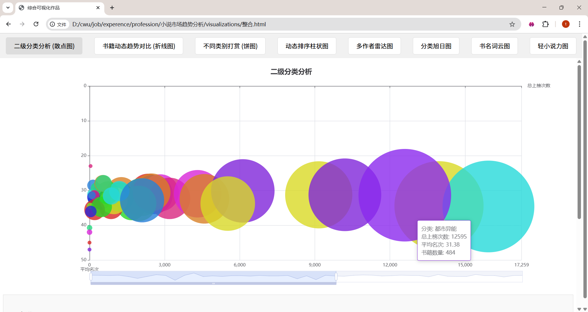
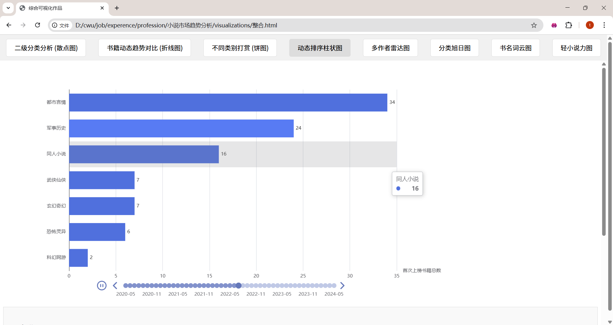
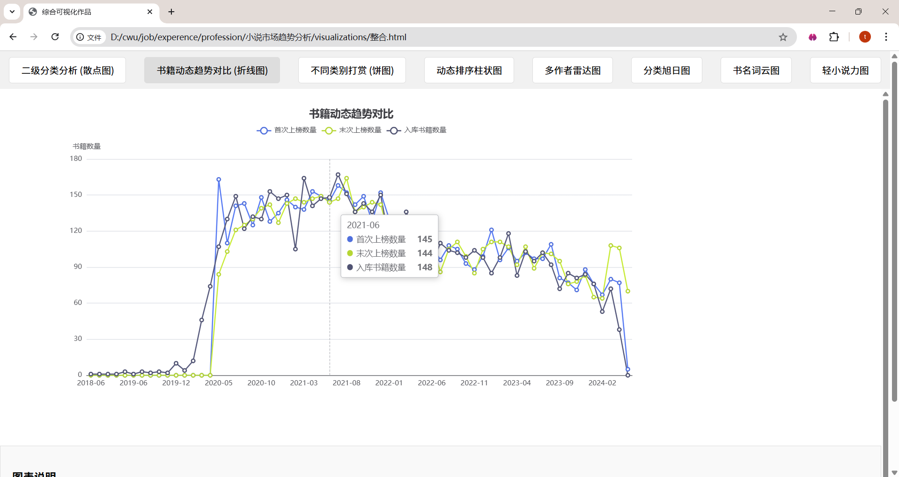
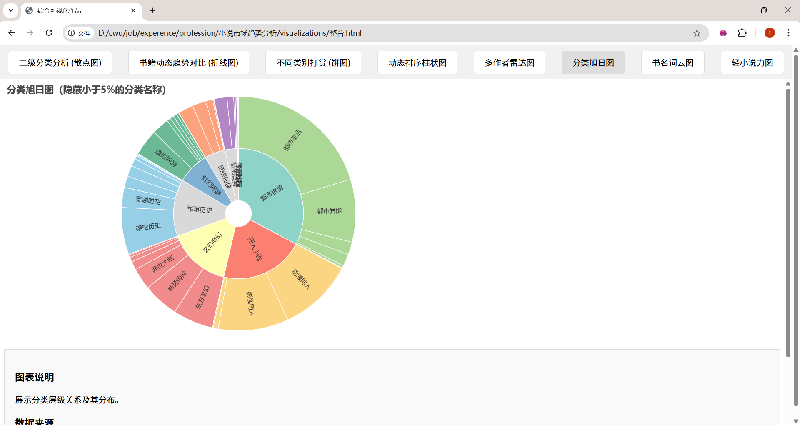
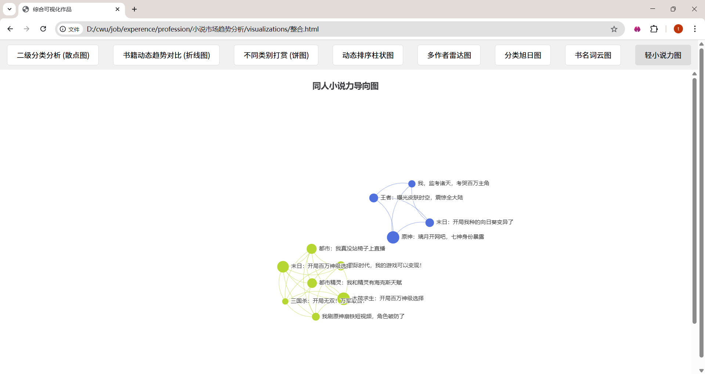

# 小说市场趋势分析

## 项目描述

本项目是一个基于小说数据的市场趋势分析与可视化展示系统。通过对小说数据的深入分析，我们探索了不同类别小说的市场表现、作者影响力、读者打赏行为等多个维度，并通过丰富的可视化图表呈现分析结果。

## 项目结构

```
小说市场趋势分析/
├── visualizations/        # 可视化结果HTML文件
│   ├── charts/           # 各类可视化图表
│   │   ├── book.json                 # 数据文件
│   │   ├── hidden_small_labels_sunburst_chart.html  # 旭日图
│   │   ├── 不同类别的打赏_饼图.html          # 打赏类别饼图
│   │   ├── 书籍动态趋势对比.html            # 书籍趋势对比
│   │   ├── 二级分类分析_散点图.html          # 分类散点图
│   │   ├── 力图.html                     # 力导向图
│   │   ├── 动态排序柱状图.html              # 动态排序柱状图
│   │   ├── 同人小说_力导向数据.json          # 同人小说数据
│   │   ├── 多作者雷达图对比.html             # 作者雷达图
│   │   └── 词云.html                     # 词云图
│   ├── 整合.html          # 整合页面
│   └── 第一页.html        # 项目首页
├── images/               # 可视化截图
│   ├── 二分类散点图.png                  # 二分类散点图截图
│   ├── 动态排序柱状图.png                # 动态排序柱状图截图
│   ├── 动态趋势折线图.png                # 动态趋势折线图截图
│   ├── 多作者雷达图.png                  # 多作者雷达图截图
│   ├── 旭日分类图.png                    # 旭日分类图截图
│   ├── 词云图.png                      # 词云图截图
│   ├── 轻力小说图.png                    # 轻小说力图截图
│   └── 饼图.png                        # 饼图截图
├── data/                 # 原始数据文件
│   └── 飞卢小说数据.xlsx   # 小说数据集
├── scripts/              # Python处理脚本
│   ├── book_bin1.py      # 数据处理脚本
│   ├── book_ciyun.py     # 词云生成脚本
│   ├── book_lei.py       # 分类分析脚本
│   ├── book_san_1.py     # 散点图生成脚本
│   ├── book_xuri.py      # 旭日图生成脚本
│   ├── book_zhe.py       # 折线图生成脚本
│   └── book_zhu.py       # 柱状图生成脚本
├── README.md             # 项目文档
├── .gitignore            # Git忽略规则
├── 项目改进建议.md        # 优化建议文档
└── 小说数据可视化展示.mp4  # 项目展示视频
```

## 技术栈

- **数据处理**: Python
- **数据可视化**: ECharts、HTML、JavaScript
- **开发环境**: PyCharm
- **数据格式**: Excel、JSON

## 使用说明

1. **查看可视化结果**:
   - 打开 `visualizations/第一页.html` 开始浏览项目
   - 通过导航访问不同的可视化图表

2. **运行数据处理脚本**:
   - 确保安装了Python及相关依赖
   - 在 `scripts/` 目录下运行相应的Python脚本
   - 脚本将生成新的可视化图表或数据文件到 `visualizations/` 目录

## 项目文件说明

### 可视化文件 (visualizations/)
- `第一页.html`: 项目首页，提供导航入口
- `整合.html`: 整合所有可视化结果的页面
- `charts/`: 包含各种类型的可视化图表，如饼图、柱状图、散点图、词云等

### 截图文件 (images/)
- 包含所有可视化图表的截图，方便快速查看可视化效果

### 数据文件 (data/)
- `飞卢小说数据.xlsx`: 原始小说数据集

### 脚本文件 (scripts/)
- `book_bin1.py`: 数据处理脚本
- `book_ciyun.py`: 词云图生成脚本
- `book_lei.py`: 小说分类分析脚本
- `book_san_1.py`: 散点图可视化脚本
- `book_xuri.py`: 旭日图可视化脚本
- `book_zhe.py`: 折线图可视化脚本
- `book_zhu.py`: 柱状图可视化脚本

## 项目特色

1. **多维度分析**: 涵盖小说类别、作者、打赏、读者行为等多个维度
2. **丰富的可视化**: 使用多种图表类型，包括饼图、柱状图、散点图、词云、力导向图等
3. **交互式体验**: 部分图表支持交互操作，增强用户体验
4. **动态效果**: 实现了动态排序柱状图等动态可视化效果

## 可视化效果展示

### 二分类散点图


### 动态排序柱状图


### 动态趋势折线图


### 多作者雷达图


### 旭日分类图


### 词云图


### 轻力小说图


### 饼图


## 许可证

MIT License

## GitHub仓库

本项目已开源在GitHub上，欢迎访问：

- **仓库地址**: [https://github.com/tongrui668-cmyk/novel-market-trends-analysis.git](https://github.com/tongrui668-cmyk/novel-market-trends-analysis.git)

## 更新日志

- 2025-12-18: 项目优化，标准化结构，合并冗余脚本，提高代码质量
- 2025-12-18: 项目上传至GitHub，添加.gitignore文件

